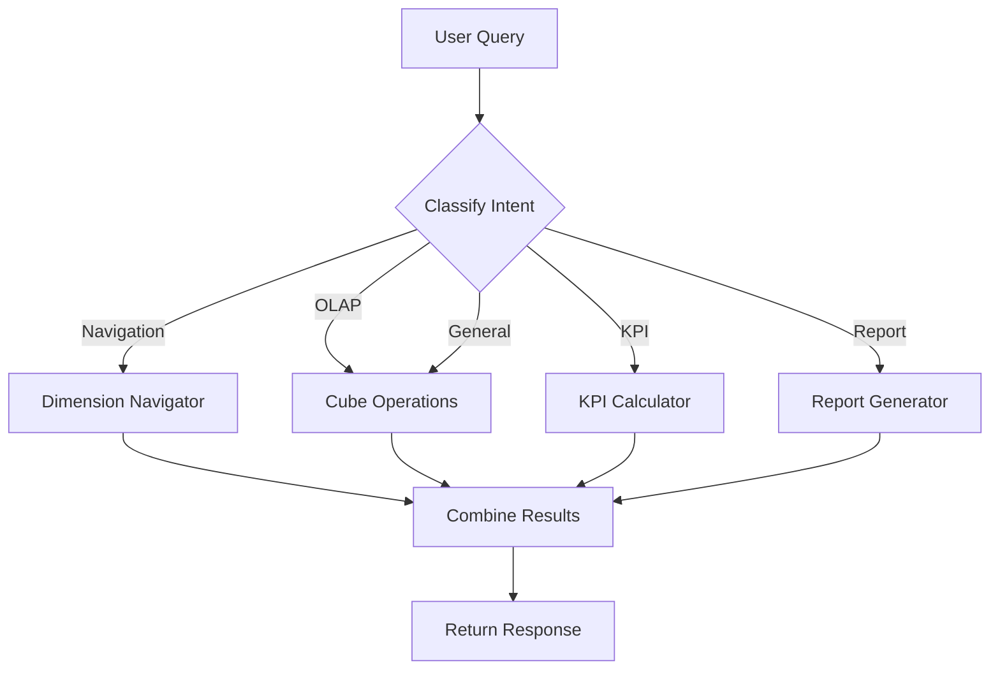

# Agent Specifications Document

## Overview

The OLAP Assistant employs a multi-agent architecture where specialized agents handle different aspects of query processing. Each agent has a specific purpose, defined inputs/outputs, and implements particular capabilities.

---

## Architecture Diagram

```
                    ┌──────────────────────────────┐
                    │      User Natural Language    │
                    │           Query               │
                    └──────────────┬───────────────┘
                                   │
                                   ▼
┌──────────────────────────────────────────────────────────────────────────┐
│                            ORCHESTRATOR                                   │
│                                                                           │
│  ┌─────────────────┐  ┌─────────────────┐  ┌─────────────────┐          │
│  │ Intent          │  │ Entity          │  │ Agent           │          │
│  │ Classification  │──▶│ Extraction     │──▶│ Routing         │          │
│  └─────────────────┘  └─────────────────┘  └─────────────────┘          │
└───────────────┬──────────────┬──────────────┬──────────────┬─────────────┘
                │              │              │              │
        ┌───────┘              │              │              └───────┐
        ▼                      ▼              ▼                      ▼
┌───────────────┐      ┌───────────────┐ ┌───────────────┐  ┌───────────────┐
│   Dimension   │      │     Cube      │ │     KPI       │  │    Report     │
│   Navigator   │      │  Operations   │ │  Calculator   │  │   Generator   │
│     Agent     │      │    Agent      │ │    Agent      │  │     Agent     │
└───────────────┘      └───────────────┘ └───────────────┘  └───────────────┘
```

---

## Agent 1: Dimension Navigator

### Purpose
Navigate through the multidimensional data structure, helping users understand available dimensions, hierarchies, and data exploration paths.

### Location
`/backend/agents/dimension_navigator.py`

### Input
| Input | Type | Description |
|-------|------|-------------|
| Natural language query | String | Questions about data structure |
| Dimension name | String | Specific dimension to explore |

### Output
| Output | Type | Description |
|--------|------|-------------|
| Dimension list | List[Dict] | All available dimensions with metadata |
| Hierarchy | List[str] | Hierarchy levels for a dimension |
| Values | List[str] | Possible values for a dimension |
| Drill suggestions | Dict | Recommended navigation paths |

### Capabilities

| Capability | Method | Description |
|------------|--------|-------------|
| List Dimensions | `get_all_dimensions()` | Return all dimensions with types and hierarchies |
| Show Hierarchy | `get_dimension_hierarchy(name)` | Get hierarchy levels (e.g., Year→Quarter→Month) |
| Get Values | `get_dimension_values(name)` | Return all values for a dimension |
| Suggest Path | `suggest_drill_path(dim, level)` | Recommend drill-down or roll-up options |

### Defined Dimensions

```python
dimensions = {
    "time": Dimension(
        name="Time",
        type=DimensionType.TIME,
        hierarchy=["Year", "Quarter", "Month", "Day"],
        values=["2022", "2023", "2024"]
    ),
    "geography": Dimension(
        name="Geography", 
        type=DimensionType.GEOGRAPHY,
        hierarchy=["Region"],
        values=["North", "South", "East", "West", "Central"]
    ),
    "product": Dimension(
        name="Product",
        type=DimensionType.PRODUCT,
        hierarchy=["Category", "Product"],
        values=["Laptop", "Desktop", "Tablet", "Phone", "Monitor", "Keyboard", "Mouse", "Headphones"]
    )
}
```

### Example Interactions

**Query:** "What dimensions are available?"
```json
{
  "action": "list_dimensions",
  "result": [
    {"name": "Time", "type": "time", "hierarchy": ["Year", "Quarter", "Month", "Day"]},
    {"name": "Geography", "type": "geography", "hierarchy": ["Region"]},
    {"name": "Product", "type": "product", "hierarchy": ["Category", "Product"]}
  ]
}
```

---

## Agent 2: Cube Operations

### Purpose
Execute OLAP cube operations on the data warehouse, transforming high-level operation requests into executable queries.

### Location
`/backend/agents/cube_operations.py`

### Input
| Input | Type | Description |
|-------|------|-------------|
| Operation type | OLAPOperation | drill_down, roll_up, slice, dice, pivot |
| Dimensions | List[str] | Dimensions to analyze |
| Measures | List[str] | Metrics to calculate |
| Filters | Dict | Dimension value filters |

### Output
| Output | Type | Description |
|--------|------|-------------|
| Query parameters | Dict | Structured query for execution |
| Operation info | Dict | Metadata about the operation |
| Explanation | str | Human-readable description |

### Supported Operations

| Operation | Enum | Description | SQL Equivalent |
|-----------|------|-------------|----------------|
| DRILL_DOWN | `drill_down` | Navigate to more detail | More columns in GROUP BY |
| ROLL_UP | `roll_up` | Aggregate to higher level | Fewer columns in GROUP BY |
| SLICE | `slice` | Filter single dimension | WHERE with one condition |
| DICE | `dice` | Filter multiple dimensions | WHERE with multiple conditions |
| PIVOT | `pivot` | Rotate the view | Different GROUP BY ordering |
| AGGREGATE | `aggregate` | Basic aggregation | Simple GROUP BY |

### Natural Language Interpretation

The agent interprets natural language to detect OLAP operations:

```python
def interpret_natural_query(query: str) -> Dict[str, Any]:
    """
    Keyword mappings for operation detection:
    
    DRILL_DOWN: "drill", "detail", "breakdown", "by month", "by day"
    ROLL_UP:    "roll up", "total", "aggregate", "by category", "summary"
    SLICE:      "only", "just", "filter" (single dimension)
    DICE:       "and", "compare between" (multiple dimensions)
    PIVOT:      "pivot", "swap", "rotate", "cross-tab"
    """
```

### Operation Explanations

```python
explanations = {
    "drill_down": {
        "name": "Drill-Down",
        "description": "Navigate from summary to detailed data by moving down the hierarchy.",
        "example": "Year → Quarter → Month → Day",
        "use_case": "When you want to see more granular details"
    },
    "roll_up": {
        "name": "Roll-Up", 
        "description": "Aggregate data by moving up the hierarchy from detailed to summary.",
        "example": "Product → Category → All Products",
        "use_case": "When you want to see the bigger picture"
    },
    "slice": {
        "name": "Slice",
        "description": "Select a single dimension value to create a sub-cube of data.",
        "example": "Filter by Quarter = 'Q4'",
        "use_case": "When you want to focus on one specific value"
    },
    "dice": {
        "name": "Dice",
        "description": "Select multiple dimension values to create a sub-cube.",
        "example": "Region IN ('North', 'South') AND Quarter = 'Q4'",
        "use_case": "When you need multiple filters simultaneously"
    },
    "pivot": {
        "name": "Pivot",
        "description": "Rotate the data cube to view data from different perspectives.",
        "example": "Swap rows and columns in the view",
        "use_case": "When you want to see data from a different angle"
    }
}
```

---

## Agent 3: KPI Calculator

### Purpose
Calculate Key Performance Indicators and business metrics, providing interpretations and insights.

### Location
`/backend/agents/kpi_calculator.py`

### Input
| Input | Type | Description |
|-------|------|-------------|
| Data records | List[Dict] | Raw data for calculation |
| KPI type | KPIType | Type of metric to calculate |
| Time periods | Optional | Periods for comparison |

### Output
| Output | Type | Description |
|--------|------|-------------|
| KPI value | float | Calculated metric |
| Formatted value | str | Human-readable format |
| Interpretation | str | Business context explanation |
| Comparison data | Optional | Period-over-period comparison |

### Supported KPIs

| KPI | Enum | Formula | Unit |
|-----|------|---------|------|
| Year-over-Year Growth | `yoy_growth` | ((Current - Previous) / Previous) × 100 | % |
| Quarter-over-Quarter Growth | `qoq_growth` | ((Current Q - Previous Q) / Previous Q) × 100 | % |
| Month-over-Month Growth | `mom_growth` | ((Current M - Previous M) / Previous M) × 100 | % |
| Profit Margin | `profit_margin` | (Profit / Revenue) × 100 | % |
| Average Order Value | `average_order` | Total Revenue / Number of Orders | $ |
| Total Revenue | `total_revenue` | SUM(sales_amount) | $ |
| Total Units | `total_units` | SUM(quantity) | units |
| Revenue per Unit | `revenue_per_unit` | Total Revenue / Total Quantity | $ |

### Growth Interpretation Logic

```python
def _interpret_growth(growth_rate: float) -> str:
    if growth_rate > 20:
        return "Exceptional growth - significantly exceeding expectations"
    elif growth_rate > 10:
        return "Strong growth - performing well above average"
    elif growth_rate > 5:
        return "Healthy growth - meeting expectations"
    elif growth_rate > 0:
        return "Modest growth - slight improvement"
    elif growth_rate > -5:
        return "Slight decline - minor concern"
    elif growth_rate > -10:
        return "Moderate decline - requires attention"
    else:
        return "Significant decline - immediate action needed"
```

### Example Output

```json
{
  "kpi_type": "yoy_growth",
  "measure": "sales_amount",
  "results": [
    {
      "year": 2024,
      "comparison_year": 2023,
      "current_value": 85000000,
      "previous_value": 72000000,
      "growth_rate": 18.06,
      "absolute_change": 13000000,
      "interpretation": "Strong growth - performing well above average"
    }
  ]
}
```

---

## Agent 4: Report Generator

### Purpose
Generate formatted reports, summaries, and natural language explanations from analysis results.

### Location
`/backend/agents/report_generator.py`

### Input
| Input | Type | Description |
|-------|------|-------------|
| Analysis results | Dict | Data from OLAP operations |
| Report type | ReportType | summary, detailed, comparison, kpi |
| Format | ReportFormat | text, json, html, markdown |

### Output
| Output | Type | Description |
|--------|------|-------------|
| Report content | str | Formatted report |
| Data tables | str | Markdown tables |
| Natural summary | str | Human-readable insights |

### Report Types

| Type | Enum | Content |
|------|------|---------|
| Summary | `summary` | Quick overview, key metrics, highlights |
| Detailed | `detailed` | Full analysis with tables and recommendations |
| Comparison | `comparison` | Side-by-side analysis of two datasets |
| KPI Dashboard | `kpi` | All KPIs in dashboard format |
| Trend | `trend` | Time-based analysis |

### Report Templates

**Summary Template:**
```markdown
# {title}
Generated: {timestamp}

## Overview
{overview}

## Key Metrics
{metrics}

## Highlights
{highlights}
```

**Comparison Template:**
```markdown
# {title}
Generated: {timestamp}

## Comparison Overview
{overview}

## Side-by-Side Analysis
{comparison_data}

## Key Differences
{differences}

## Insights
{insights}
```

### Natural Language Summary Generation

The agent generates business-friendly summaries:

```python
def generate_natural_language_summary(analysis_result: Dict) -> str:
    """
    Example output:
    
    Based on the slice analysis across region:
    
    **Top Performer**: North leads with $47,817,761.80 in sales
    **Lowest Performer**: South has $42,458,234.90 in sales
    **Total across all groups**: $224,554,317.44
    **Average per group**: $44,910,863.49
    
    The top performer generates 21.3% of total sales in this view.
    
    *Filters applied: quarter=Q4*
    """
```

---

## Orchestrator

### Purpose
Central coordinator that classifies query intent, extracts entities, and routes to appropriate agents.

### Location
`/backend/planner/orchestrator.py`

### Intent Classification

| Intent | Patterns | Agent Routed |
|--------|----------|--------------|
| NAVIGATION | "dimensions", "hierarchy", "available" | Dimension Navigator |
| OLAP_OPERATION | "drill", "slice", "compare", "by region" | Cube Operations |
| KPI_CALCULATION | "growth", "margin", "YoY", "performance" | KPI Calculator |
| REPORT_GENERATION | "export", "report", "summary" | Report Generator |
| GENERAL_ANALYSIS | (default) | Cube Operations |

### Entity Extraction

The orchestrator extracts:
- **Dimensions**: region, product, category, quarter, month, year
- **Measures**: sales_amount, quantity, profit_margin
- **Filters**: Specific values for dimensions (e.g., Q4, North, 2024)

### Routing Flow



### Response Format

```json
{
  "query": "Show Q4 sales by region",
  "intent": "olap",
  "entities": {
    "dimensions": ["region"],
    "measures": ["sales_amount"],
    "filters": {"quarter": "Q4"}
  },
  "agents_used": ["cube_operations"],
  "result": {
    "operation": "slice",
    "data": [...],
    "row_count": 5
  }
}
```

---

## Agent Communication Protocol

### Message Format

All agents communicate using a standardized format:

```json
{
  "query": "Original user query",
  "intent": "classified_intent",
  "entities": {
    "dimensions": ["list of dimensions"],
    "measures": ["list of measures"],
    "filters": {"key": "value"}
  },
  "agents_used": ["agent_1", "agent_2"],
  "result": {},
  "error": null
}
```

### Error Handling

Each agent implements graceful error handling:

| Error Type | Handling |
|------------|----------|
| Invalid dimension | Suggest valid options |
| Missing data | Return informative message |
| Query ambiguity | Make reasonable assumption and note it |
| Calculation error | Return partial results with error flag |

---

## Adding New Agents

To extend the system with a new agent:

1. Create new file in `/backend/agents/`
2. Implement standard interface methods
3. Register in orchestrator's agent dictionary
4. Add intent patterns for routing
5. Update documentation
