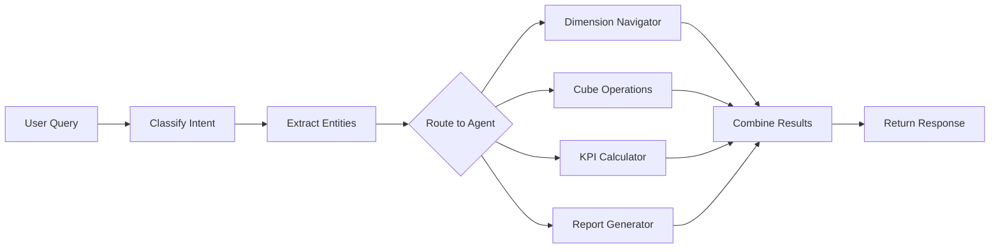

# Agent Specifications

## Overview

The OLAP Assistant uses a multi-agent architecture where specialized agents handle different aspects of query processing.

---

## Agent 1: Dimension Navigator

### Purpose
Navigate through the multidimensional data structure, helping users understand available dimensions and hierarchies.

### Input
- Natural language queries about data structure
- Dimension exploration requests

### Output
- List of available dimensions
- Hierarchy information
- Navigation suggestions

### Capabilities
| Capability | Description |
|------------|-------------|
| List Dimensions | Return all available dimensions |
| Show Hierarchy | Display hierarchy levels for a dimension |
| Get Values | Return possible values for a dimension |
| Suggest Path | Recommend drill-down or roll-up paths |

### Example Interactions

```
Input: "What dimensions are available?"
Output: {
  "dimensions": [
    {"name": "Time", "hierarchy": ["Year", "Quarter", "Month"]},
    {"name": "Geography", "hierarchy": ["Region"]},
    {"name": "Product", "hierarchy": ["Category", "Product"]}
  ]
}
```

---

## Agent 2: Cube Operations

### Purpose
Execute OLAP cube operations: drill-down, roll-up, slice, dice, and pivot.

### Input
- Operation type
- Dimensions and measures
- Filter conditions

### Output
- Aggregated data results
- Operation metadata
- Suggestions for further analysis

### Supported Operations

| Operation | Description | Example |
|-----------|-------------|---------|
| DRILL_DOWN | Navigate to more detail | Year → Quarter |
| ROLL_UP | Aggregate to higher level | Product → Category |
| SLICE | Filter single dimension | Quarter = Q4 |
| DICE | Filter multiple dimensions | Q4 AND North |
| PIVOT | Rotate the view | Swap rows/columns |

### Query Interpretation

```python
def interpret_natural_query(query: str) -> Dict:
    """
    Maps natural language to OLAP operations.
    
    "Drill into Q4 by month" → DRILL_DOWN
    "Show total by category" → ROLL_UP
    "Only Q4 data" → SLICE
    "Q4 in North region" → DICE
    """
```

---

## Agent 3: KPI Calculator

### Purpose
Calculate Key Performance Indicators and business metrics.

### Input
- Data records
- KPI type requested
- Comparison periods

### Output
- Calculated KPI values
- Formatted results
- Interpretations

### Supported KPIs

| KPI | Formula | Use Case |
|-----|---------|----------|
| YoY Growth | (Current - Previous) / Previous × 100 | Annual comparison |
| QoQ Growth | (Current Q - Previous Q) / Previous Q × 100 | Quarterly trends |
| MoM Growth | (Current M - Previous M) / Previous M × 100 | Monthly tracking |
| Profit Margin | Profit / Revenue × 100 | Profitability |
| Avg Order Value | Total Revenue / Number of Orders | Transaction analysis |

### Interpretation Engine

```python
def _interpret_growth(growth_rate: float) -> str:
    if growth_rate > 20:
        return "Exceptional growth"
    elif growth_rate > 10:
        return "Strong growth"
    elif growth_rate > 5:
        return "Healthy growth"
    elif growth_rate > 0:
        return "Modest growth"
    elif growth_rate > -5:
        return "Slight decline"
    else:
        return "Significant decline"
```

---

## Agent 4: Report Generator

### Purpose
Generate formatted reports and human-readable summaries.

### Input
- Analysis results
- Report type
- Format preferences

### Output
- Formatted reports (Markdown, JSON, HTML)
- Natural language summaries
- Export-ready data

### Report Types

| Type | Description | Content |
|------|-------------|---------|
| Summary | Quick overview | Key metrics, highlights |
| Detailed | Full analysis | Tables, charts, recommendations |
| Comparison | Side-by-side | Two datasets compared |
| KPI | Dashboard style | All KPIs in one view |

### Template System

```python
TEMPLATES = {
    "summary": """
    # {title}
    Generated: {timestamp}
    
    ## Overview
    {overview}
    
    ## Key Metrics
    {metrics}
    """,
    ...
}
```

---

## Orchestrator

### Purpose
Coordinate between agents, classify queries, and combine results.

### Responsibilities
1. **Intent Classification**: Determine query type
2. **Entity Extraction**: Pull dimensions, filters, measures
3. **Agent Routing**: Direct to appropriate agent
4. **Result Combination**: Merge multi-agent responses

### Intent Classification

| Intent | Keywords | Agent |
|--------|----------|-------|
| NAVIGATION | "dimensions", "hierarchy", "available" | Dimension Navigator |
| OLAP | "drill", "slice", "compare", "by region" | Cube Operations |
| KPI | "growth", "margin", "YoY", "performance" | KPI Calculator |
| REPORT | "export", "report", "summary" | Report Generator |

### Flow Diagram



---

## Agent Communication

### Message Format

```json
{
  "query": "Original user query",
  "intent": "classified_intent",
  "entities": {
    "dimensions": ["region"],
    "measures": ["sales_amount"],
    "filters": {"quarter": "Q4"}
  },
  "agents_used": ["cube_operations"],
  "result": { ... }
}
```

### Error Handling

Each agent implements graceful error handling:
- Invalid dimension → Suggest valid options
- Missing data → Return informative message
- Query ambiguity → Ask for clarification
