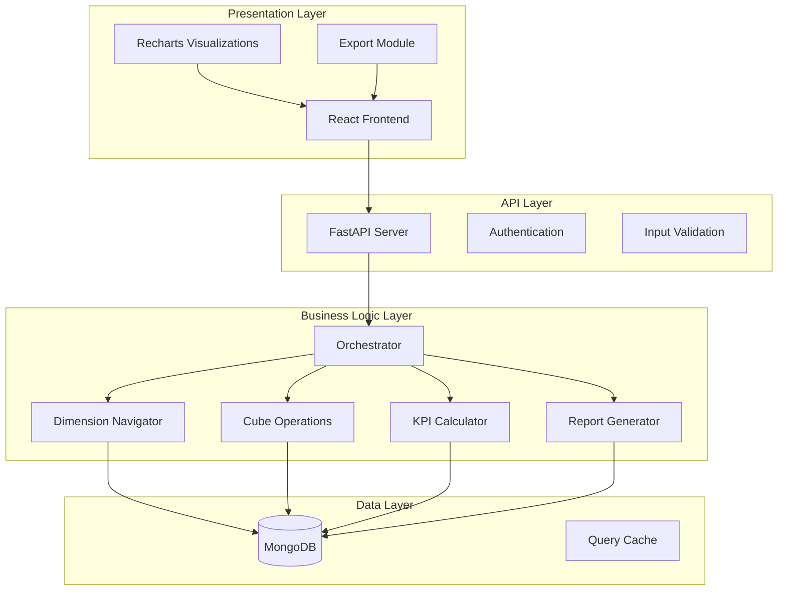
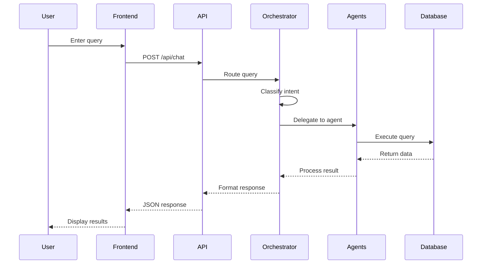
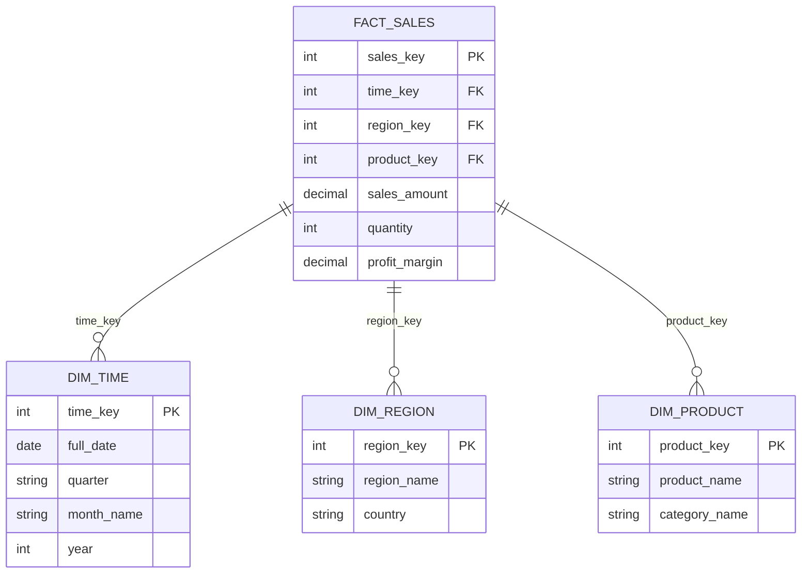

# Architecture Document

## System Overview

The OLAP Assistant is a multi-tier application designed to enable natural language business intelligence queries.

## Architecture Diagram

## Component Details

### 1. Frontend (React.js)

**Responsibilities:**
- User interface rendering
- Query input handling
- Data visualization
- Export functionality

**Key Components:**
- `OLAPDashboard.jsx` - Main dashboard component
- Chart components (Bar, Pie, Line, Area)
- Filter Builder dialog
- Query History panel

### 2. Backend (FastAPI)

**Responsibilities:**
- REST API endpoints
- Request validation
- Agent coordination
- Data processing

**Key Files:**
- `server.py` - Main application
- `agents/` - Specialized agents
- `planner/` - Orchestrator

### 3. Agent Layer

#### Dimension Navigator
- Lists available dimensions
- Shows hierarchies
- Suggests drill paths

#### Cube Operations
- Executes OLAP operations
- Builds aggregation queries
- Interprets natural language

#### KPI Calculator
- Calculates growth rates (YoY, QoQ, MoM)
- Computes profit margins
- Generates KPI summaries

#### Report Generator
- Creates formatted reports
- Generates natural language summaries
- Handles export formatting

### 4. Data Layer (MongoDB)

**Collections:**
- `sales_data` - Transaction records
- `chat_messages` - Query history

**Indexes:**
- Region, Product, Quarter, Year
- Composite indexes for OLAP queries

## Data Flow

## Star Schema Design

## Technology Stack

| Component | Technology | Purpose |
|-----------|------------|---------|
| Frontend | React 18 | UI Framework |
| Styling | Tailwind CSS | Utility-first CSS |
| Charts | Recharts | Data visualization |
| Backend | FastAPI | REST API |
| Database | MongoDB | Data storage |
| State | React Hooks | State management |

## Security Considerations

1. **Input Validation**: All queries sanitized
2. **CORS**: Configured for allowed origins
3. **Rate Limiting**: Implemented at API level
4. **Error Handling**: Graceful error responses

## Scalability

- MongoDB allows horizontal scaling
- Stateless API design
- Agent pattern enables easy extension
- Caching layer can be added

## Future Enhancements

1. Redis caching for frequent queries
2. WebSocket for real-time updates
3. Multi-tenant support
4. Advanced analytics with ML
