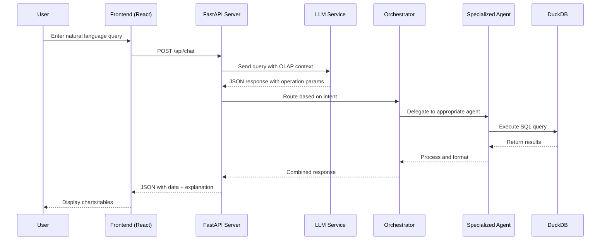
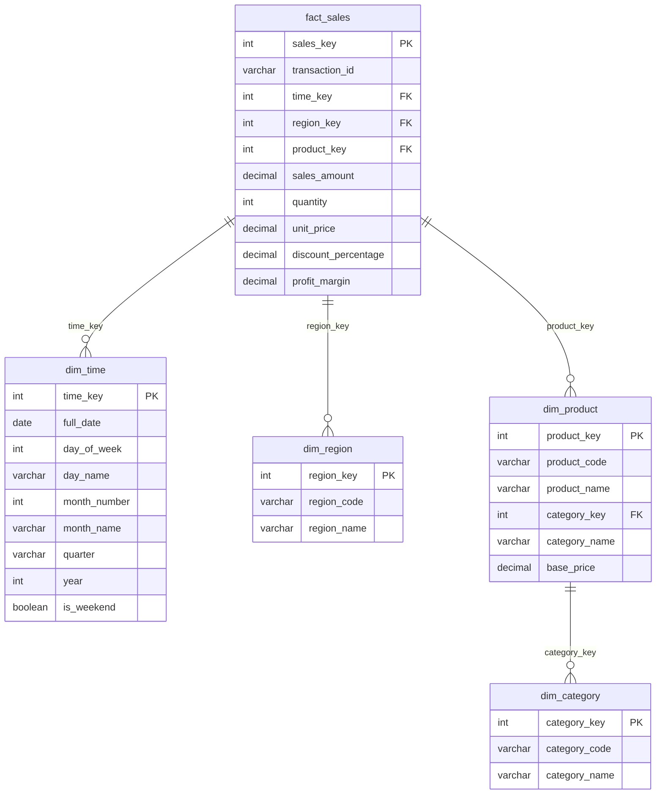

# OLAP Assistant - Architecture Document

## System Overview

The OLAP Assistant is a multi-tier, multi-agent application designed to enable natural language business intelligence queries. It transforms natural language questions into OLAP operations, executes them against a star schema data warehouse, and presents results with visualizations.

## High-Level Architecture

```
┌─────────────────────────────────────────────────────────────────────────────┐
│                           PRESENTATION LAYER                                 │
│                         React.js + Tailwind CSS                              │
│  ┌─────────────┐  ┌─────────────┐  ┌─────────────┐  ┌─────────────┐        │
│  │ Query Input │  │   Charts    │  │   Tables    │  │   Export    │        │
│  │ (Chat UI)   │  │ (Recharts)  │  │ (Data Grid) │  │ (CSV/PDF)   │        │
│  └─────────────┘  └─────────────┘  └─────────────┘  └─────────────┘        │
└─────────────────────────────────────────────────────────────────────────────┘
                                      │
                                      ▼
┌─────────────────────────────────────────────────────────────────────────────┐
│                             API LAYER                                        │
│                           FastAPI Server                                     │
│  ┌──────────────────────────────────────────────────────────────────────┐  │
│  │                         REST Endpoints                                │  │
│  │   /api/chat  │  /api/data/*  │  /api/olap/*  │  /api/agents/*       │  │
│  └──────────────────────────────────────────────────────────────────────┘  │
└─────────────────────────────────────────────────────────────────────────────┘
                                      │
                                      ▼
┌─────────────────────────────────────────────────────────────────────────────┐
│                         BUSINESS LOGIC LAYER                                 │
│                        Multi-Agent Architecture                              │
│  ┌─────────────────────────────────────────────────────────────────────┐   │
│  │                        ORCHESTRATOR                                  │   │
│  │           (Query Classification, Entity Extraction, Routing)         │   │
│  └─────────────────────────────────────────────────────────────────────┘   │
│         │                │                │                │                │
│         ▼                ▼                ▼                ▼                │
│  ┌───────────┐   ┌───────────┐   ┌───────────┐   ┌───────────┐           │
│  │ Dimension │   │   Cube    │   │    KPI    │   │  Report   │           │
│  │ Navigator │   │Operations │   │Calculator │   │ Generator │           │
│  │   Agent   │   │   Agent   │   │   Agent   │   │   Agent   │           │
│  └───────────┘   └───────────┘   └───────────┘   └───────────┘           │
└─────────────────────────────────────────────────────────────────────────────┘
                                      │
                                      ▼
┌─────────────────────────────────────────────────────────────────────────────┐
│                           DATA LAYER                                         │
│                    DuckDB Star Schema Warehouse                              │
│  ┌───────────────────────────────────────────────────────────────────────┐ │
│  │                         STAR SCHEMA                                    │ │
│  │   ┌──────────┐  ┌──────────┐  ┌──────────┐                           │ │
│  │   │dim_time  │  │dim_region│  │dim_product│   (Dimension Tables)     │ │
│  │   └────┬─────┘  └────┬─────┘  └────┬─────┘                           │ │
│  │        │             │             │                                  │ │
│  │        └─────────────┼─────────────┘                                  │ │
│  │                      ▼                                                 │ │
│  │              ┌──────────────┐                                         │ │
│  │              │  fact_sales  │    (Fact Table: 10,000+ records)       │ │
│  │              └──────────────┘                                         │ │
│  └───────────────────────────────────────────────────────────────────────┘ │
└─────────────────────────────────────────────────────────────────────────────┘
```

## Sequence Diagram - Query Processing



## Star Schema Design



## Component Details

### 1. Frontend (React.js)

**Location:** `/frontend/src/`

**Responsibilities:**
- User interface rendering with responsive design
- Natural language query input handling
- Data visualization using Recharts
- Export functionality (CSV, Excel, PDF)
- Query history and bookmarking
- Dark/Light mode toggle

**Key Components:**
| Component | Purpose |
|-----------|---------|
| `OLAPDashboard.jsx` | Main dashboard with all features |
| `ChatMessage` | Renders chat conversation |
| `ResultsTable` | Displays data in tabular format |
| `ResultsCharts` | Renders Bar/Pie/Line/Area charts |
| `MetricCard` | Shows KPI summary cards |
| `OLAPGuide` | Educational component explaining OLAP |
| `DataCubeVisualization` | 3D cube diagram |

**Technologies:**
- React 18 with Hooks
- Tailwind CSS for styling
- Recharts for visualizations
- shadcn/ui for UI components
- xlsx, jspdf for exports

### 2. Backend (FastAPI)

**Location:** `/backend/server.py`

**Responsibilities:**
- REST API endpoints for all operations
- LLM integration for natural language processing
- Agent coordination through orchestrator
- Data access via DuckDB manager

**Key Endpoints:**
| Endpoint | Method | Purpose |
|----------|--------|---------|
| `/api/chat` | POST | Process natural language queries |
| `/api/data/summary` | GET | Get data warehouse summary |
| `/api/data/init` | POST | Initialize/regenerate data |
| `/api/olap/query` | POST | Execute direct OLAP queries |
| `/api/olap/sales-by-*` | GET | Pre-built OLAP queries |
| `/api/agents/status` | GET | Get agent health status |
| `/api/dimensions` | GET | List available dimensions |
| `/api/kpi/summary` | GET | Calculate KPI metrics |

### 3. Agent Layer

**Location:** `/backend/agents/`

The system uses a multi-agent architecture where each agent specializes in a specific aspect of OLAP analysis:

#### Orchestrator (`/backend/planner/orchestrator.py`)
- **Role:** Central coordinator that routes queries to appropriate agents
- **Functions:**
  - Intent classification (Navigation, OLAP, KPI, Report)
  - Entity extraction (dimensions, measures, filters)
  - Agent delegation and result combination

#### Dimension Navigator Agent
- **Role:** Navigate and explore data dimensions
- **Capabilities:** List dimensions, show hierarchies, suggest drill paths

#### Cube Operations Agent
- **Role:** Execute OLAP cube operations
- **Operations:** Drill-down, Roll-up, Slice, Dice, Pivot

#### KPI Calculator Agent
- **Role:** Calculate business metrics
- **Metrics:** YoY/QoQ/MoM growth, profit margins, averages

#### Report Generator Agent
- **Role:** Format and generate reports
- **Outputs:** Markdown reports, summaries, comparisons

### 4. Data Layer (DuckDB)

**Location:** `/backend/database/`

**Why DuckDB:**
- Optimized for OLAP workloads
- Embedded database (no server needed)
- Fast analytical queries
- SQL-compliant
- Lightweight and portable

**Star Schema Tables:**
| Table | Type | Records | Purpose |
|-------|------|---------|---------|
| `fact_sales` | Fact | 10,000+ | Transaction data |
| `dim_time` | Dimension | ~1,100 | Time hierarchy (2022-2024) |
| `dim_region` | Dimension | 5 | Geographic regions |
| `dim_product` | Dimension | 8 | Product catalog |
| `dim_category` | Dimension | 3 | Product categories |

## Technology Stack

| Layer | Technology | Version | Purpose |
|-------|------------|---------|---------|
| Frontend | React.js | 18.x | UI Framework |
| Styling | Tailwind CSS | 3.x | Utility CSS |
| Charts | Recharts | 2.x | Visualizations |
| UI Components | shadcn/ui | - | Component library |
| Backend | FastAPI | 0.110 | REST API |
| Database | DuckDB | 1.4+ | OLAP warehouse |
| Language | Python | 3.11 | Backend runtime |
| LLM Integration | Claude | Sonnet | NL processing |

## Data Flow

### Query Processing Flow

1. **User Input**: User types natural language query
2. **API Request**: Frontend sends POST to `/api/chat`
3. **LLM Processing**: Query sent to Claude with OLAP context
4. **JSON Parsing**: Extract operation, dimensions, filters from LLM response
5. **Orchestration**: Router directs to appropriate agent
6. **Query Execution**: DuckDB executes star schema SQL
7. **Result Formatting**: Agent formats results with metadata
8. **API Response**: JSON response with data and explanation
9. **Visualization**: Frontend renders charts and tables

### OLAP Query Translation

```
Natural Language: "Show Q4 sales by region"
        │
        ▼
LLM JSON Output:
{
    "operation": "slice",
    "dimensions": ["region"],
    "measures": ["sales_amount"],
    "filters": {"quarter": "Q4"}
}
        │
        ▼
SQL Query:
SELECT r.region_name, SUM(f.sales_amount), AVG(f.sales_amount)
FROM fact_sales f
JOIN dim_time t ON f.time_key = t.time_key
JOIN dim_region r ON f.region_key = r.region_key
WHERE t.quarter = 'Q4'
GROUP BY r.region_name
ORDER BY SUM(f.sales_amount) DESC
```

## Security Considerations

1. **Input Validation**: All user inputs sanitized before processing
2. **CORS Configuration**: Restricted to allowed origins
3. **Error Handling**: Graceful error responses without exposing internals
4. **SQL Injection Prevention**: Parameterized queries in DuckDB

## Scalability Considerations

- **Horizontal Scaling**: Stateless API design allows multiple instances
- **Query Optimization**: Star schema with indexes for common queries
- **Caching Potential**: Can add Redis layer for frequent queries
- **Agent Architecture**: New agents can be added without modifying existing ones

## Future Enhancement Possibilities

1. **Real-time Data**: WebSocket for live updates
2. **Multi-tenant**: Support for multiple datasets/users
3. **Machine Learning**: Predictive analytics agents
4. **Natural Language Generation**: More sophisticated explanations
5. **Dashboard Sharing**: Exportable/shareable analysis views
